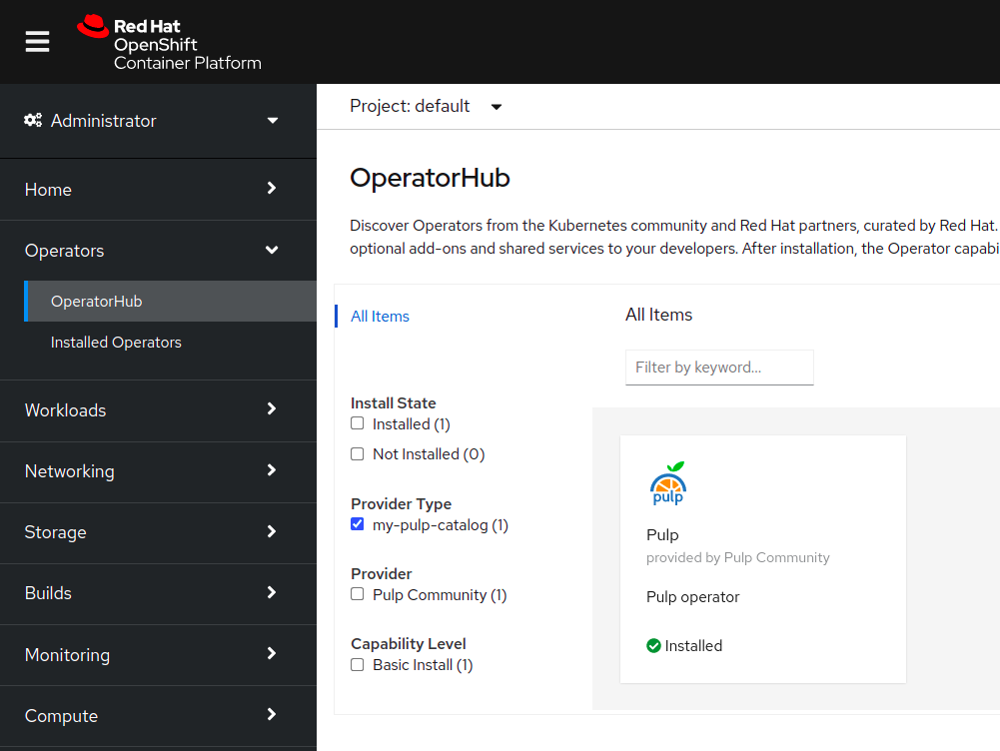
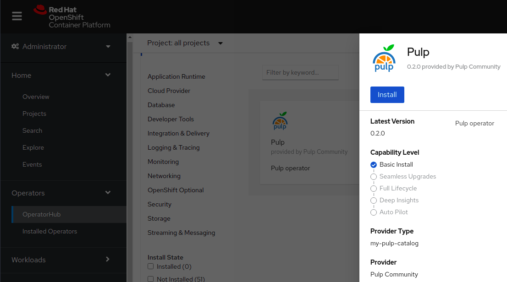
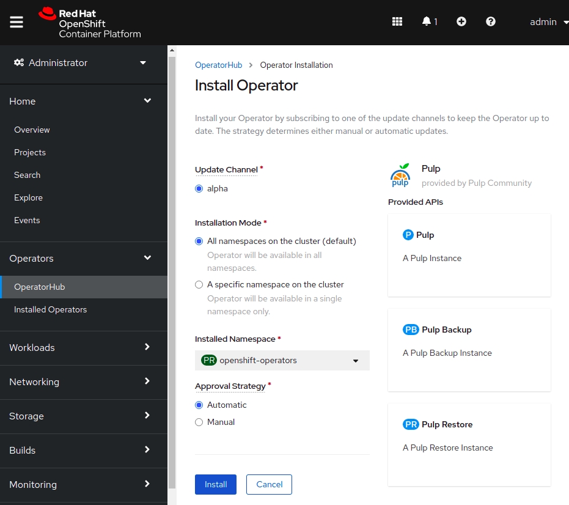

# Getting started

## Kubernetes

### Basic Install

This Kubernetes Operator is meant to be deployed in your Kubernetes cluster(s) and can manage one or more Pulp instances in any namespace.

For testing purposes, the `pulp-operator` can be deployed on a [Minikube](https://minikube.sigs.k8s.io/docs/) cluster. Due to different OS and hardware environments, please refer to the official Minikube documentation for further information.

```
$ minikube start --vm-driver=docker --extra-config=apiserver.service-node-port-range=80-32000
😄  minikube v1.23.2 on Fedora 34
✨  Using the docker driver based on user configuration
👍  Starting control plane node minikube in cluster minikube
🚜  Pulling base image ...
🔥  Creating docker container (CPUs=2, Memory=7900MB) ...
🐳  Preparing Kubernetes v1.22.2 on Docker 20.10.8 ...
    ▪ apiserver.service-node-port-range=80-32000
    ▪ Generating certificates and keys ...
    ▪ Booting up control plane ...
    ▪ Configuring RBAC rules ...
🔎  Verifying Kubernetes components...
    ▪ Using image gcr.io/k8s-minikube/storage-provisioner:v5
🌟  Enabled addons: storage-provisioner, default-storageclass
💡  kubectl not found. If you need it, try: 'minikube kubectl -- get pods -A'
🏄  Done! kubectl is now configured to use "minikube" cluster and "default" namespace by default

```

Once Minikube is deployed, check if the node(s) and `kube-apiserver` communication is working as expected.

```
$ minikube kubectl -- get nodes
NAME       STATUS   ROLES                  AGE    VERSION
minikube   Ready    control-plane,master   113s   v1.22.2

$ minikube kubectl -- get pods -A
NAMESPACE       NAME                                        READY   STATUS      RESTARTS   AGE
kube-system   coredns-78fcd69978-fdm96           1/1     Running   0             94s
kube-system   etcd-minikube                      1/1     Running   0             107s
kube-system   kube-apiserver-minikube            1/1     Running   0             107s
kube-system   kube-controller-manager-minikube   1/1     Running   0             107s
kube-system   kube-proxy-5s54z                   1/1     Running   0             95s
kube-system   kube-scheduler-minikube            1/1     Running   0             107s
kube-system   storage-provisioner                1/1     Running   1 (62s ago)   106s
```

It is not required for `kubectl` to be separately installed since it comes already wrapped inside minikube. As demonstrated above, simply prefix `minikube kubectl --` before kubectl command, i.e. `kubectl get nodes` would become `minikube kubectl -- get nodes`

Let's create an alias for easier usage:

```
$ alias kubectl="minikube kubectl --"
```

Now you need to deploy Pulp Operator into your cluster. Clone this repo and `git checkout` the latest version from [https://github.com/pulp/pulp-operator/releases](https://github.com/pulp/pulp-operator/releases), and then run the following command:

```
$ export NAMESPACE=my-namespace
$ make deploy
cd config/manager && /usr/local/bin/kustomize edit set image controller=quay.io/pulp/pulp-operator:v0.5.0.dev
cd config/default && /usr/local/bin/kustomize edit set namespace pulp-operator-system
/usr/local/bin/kustomize build config/default | kubectl apply -f -
namespace/pulp-operator-system created
customresourcedefinition.apiextensions.k8s.io/pulpbackups.pulp.pulpproject.org created
customresourcedefinition.apiextensions.k8s.io/pulprestores.pulp.pulpproject.org created
customresourcedefinition.apiextensions.k8s.io/pulps.pulp.pulpproject.org created
serviceaccount/pulp-operator-sa created
role.rbac.authorization.k8s.io/pulp-operator-leader-election-role created
role.rbac.authorization.k8s.io/pulp-operator-proxy-role created
role.rbac.authorization.k8s.io/pulp-operator-pulp-manager-role created
clusterrole.rbac.authorization.k8s.io/pulp-operator-metrics-reader created
rolebinding.rbac.authorization.k8s.io/pulp-operator-leader-election-rolebinding created
rolebinding.rbac.authorization.k8s.io/pulp-operator-proxy-rolebinding created
rolebinding.rbac.authorization.k8s.io/pulp-operator-pulp-manager-rolebinding created
configmap/pulp-operator-pulp-manager-config created
service/pulp-operator-controller-manager-metrics-service created
deployment.apps/pulp-operator-controller-manager created
networkpolicy.networking.k8s.io/pulp-operator-allow-same-namespace created
```

Wait a bit and you should have the `pulp-operator` running:

```
$ kubectl get pods -n $NAMESPACE
NAME                                               READY   STATUS    RESTARTS   AGE
pulp-operator-controller-manager-8d8b6967f-6lspp   2/2     Running   0          11s
```

So we don't have to keep repeating `-n $NAMESPACE`, let's set the current namespace for `kubectl`:

```
$ kubectl config set-context --current --namespace=$NAMESPACE
```

Next, review `config/samples/pulpproject_v1beta1_pulp_cr.default.yaml`. If the variables' default values are not correct for your environment, copy to `config/samples/pulpproject_v1beta1_pulp_cr.yaml`, uncomment "spec:", and uncomment and adjust the variables.

Finally, use `kubectl` to create the pulp instance in your cluster:

```
$ kubectl apply -f config/samples/config/samples/pulpproject_v1beta1_pulp_cr.yaml
pulp.pulp.pulpproject.org/example-pulp created
```

After a few minutes, the new Pulp instance will be deployed. You can look at the operator pod logs in order to know where the installation process is at:

```
$ kubectl logs -f deployments/pulp-operator-controller-manager -c pulp-manager
```

After a few seconds, you should see the operator begin to create new resources:

```
$ kubectl get pods -l "app.kubernetes.io/managed-by=pulp-operator"
NAME                        READY   STATUS    RESTARTS   AGE
example-pulp-api-5bff7945fb-srfw7       0/1     Running   0             3m45s
example-pulp-content-7d86b44545-zrdpx   1/1     Running   0             3m22s
example-pulp-postgres-0                 1/1     Running   0             4m35s
example-pulp-redis-5c94fddd8d-lcqfx     1/1     Running   0             4m31s
example-pulp-web-ff98589b8-r4q8g        0/1     Running   1 (48s ago)   4m28s
example-pulp-worker-c5b8f8948-ccsrq     1/1     Running   0             3m10s


$ kubectl get svc -l "app.kubernetes.io/managed-by=pulp-operator"
NAME                TYPE        CLUSTER-IP     EXTERNAL-IP   PORT(S)        AGE
example-pulp-api-svc       ClusterIP   10.101.91.163    <none>        24817/TCP         5m31s
example-pulp-content-svc   ClusterIP   10.108.116.169   <none>        24816/TCP         5m12s
example-pulp-postgres      ClusterIP   None             <none>        5432/TCP          6m13s
example-pulp-redis         ClusterIP   10.105.207.239   <none>        6379/TCP          6m10s
example-pulp-web-svc       NodePort    10.106.203.144   <none>        24880:31428/TCP   6m3s
```

Once deployed, the Pulp instance will be accessible by running:

```
$ minikube service example-pulp-web-svc --url -n $NAMESPACE
```

By default, the admin user is `admin` and the password is available in the `<resourcename>-admin-password` secret. To retrieve the admin password, run:

```
$ kubectl get secret example-pulp-admin-password -o jsonpath="{.data.password}" | base64 --decode
yDL2Cx5Za94g9MvBP6B73nzVLlmfgPjR
```

You just completed the most basic install of an Pulp instance via this operator. Congratulations!!!

### OperatorHub

Pulp can be installed from [OperatorHub](https://operatorhub.io) on the following link:
[https://operatorhub.io/operator/pulp-operator](https://operatorhub.io/operator/pulp-operator)

### Helm Chart Install

Pulp can also be installed using Helm Charts.  
Check [Helm Chart](/pulp_operator/install/helm) section for more information.

## OpenShift

Pulp is available on `OperatorHub`, you can find it at the `Integration & Delivery` section:



For installing it, click on: `Pulp Project` and then `Install`:




Create a `Secret` with the `S3` credentials.
Note that these should be valid credentials from an already configured S3 bucket:


Click `Pulp`:


Select `S3` as the storage type and, on `S3 storage secret`, enter the name of the storage you created before,
e.g. `example-pulp-object-storage`:


Click `Advanced Configuration`,
select `Route` as Ingress type, fill in the `Route DNS host`, select `Edge` as Route TLS termination mechanism, and click on `Create`:


Wait a few minutes for pulp-operator to be successfully deployed!

You can check your `password` on `Secrets`, `example-pulp-admin-password`:


Verify your URL at `Networking > Routes`:


Use the URL from the previous step with `/pulp/api/v3/status/`path and verify Pulp was successfully deployed:

