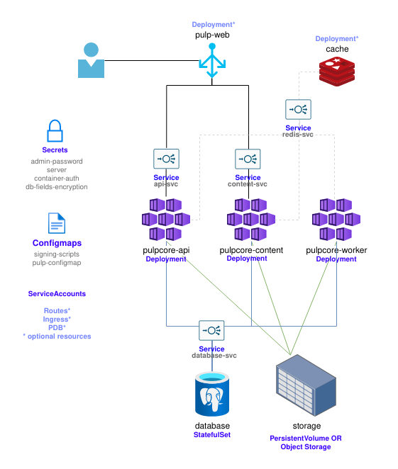

# Architecture

Here is a diagram with the components deployed by Pulp Operator:

The above picture represents a common installation.

Some components, like `pulp-web`, are not mandatory and depending on how `Pulp CR` is configured
the operator will take care of configuring the other resources that depend on them.

See the [Pulpcore documentation](https://docs.pulpproject.org/pulpcore/components.html) for more information of Pulp Architecture.
