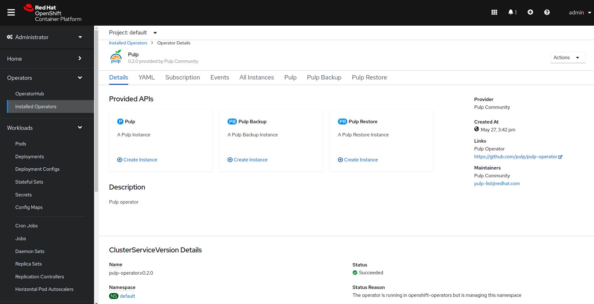
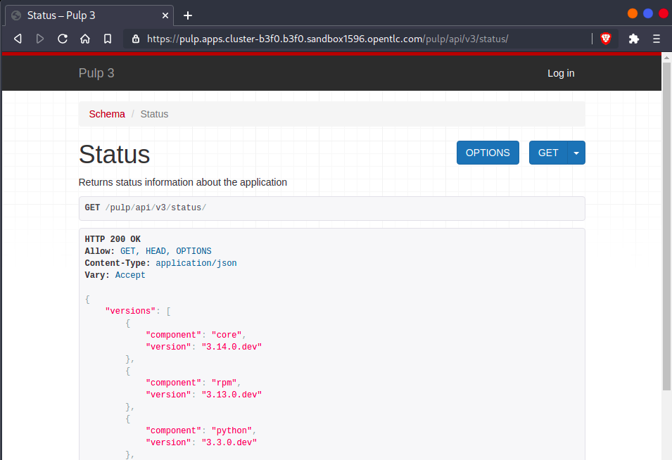

# Quickstart with OpenShift

## Install Pulp Operator

Pulp is available on OpenShift's `OperatorHub`. Open your OpenShift console and follow the instructions:

<figure markdown="span">
  <figcaption>Find Pulp  at `OperatorHub > Integration & Delivery`.</figcaption>
  
</figure>

<figure markdown="span">
  <figcaption>For installing it, click on `Pulp Project` and then `Install`.</figcaption>
  
</figure>

<figure markdown="span">
  <figcaption>Confirm the installation.</figcaption>
  
</figure>

## Setup Credentials

You should use valid credentials from an already configured S3 bucket.

<figure markdown="span">
  <figcaption>Create a `Secret` with the `S3` credentials.</figcaption>
  
</figure>

## Setup Storage

Use the name of the storage of the previous step to configure S3.
For this tutorial it is `example-pulp-object-storage`.

<figure markdown="span">
  <figcaption>Go to `Operators > Installed Operators > Pulp > Create Instance`.</figcaption>
  
</figure>

<figure markdown="span">
  <figcaption>Select `S3` storage and use your storage name on `S3 storage-secret`.</figcaption>
  
</figure>

## Setup Routes

From the previous page, click `Advanced Configuration`, fill the form as follows
and wait a few minutes for pulp-operator to be successfully deployed!

<figure markdown="span">
  <figcaption>Select `Route` as `Ingress Type`, fill `Route DNS host`, select `Edge` as Route TLS termination mechanism, and click on `Create`.</figcaption>
  
</figure>

## Check your deployment

<figure markdown="span">
  <figcaption>You can check your `password` on `Secrets`, `example-pulp-admin-password`.</figcaption>
  
</figure>

<figure markdown="span">
  <figcaption>Verify your URL at `Networking > Routes`.</figcaption>
  
</figure>

<figure markdown="span">
  <figcaption>Use the URL from the previous step with `/pulp/api/v3/status/`path and verify Pulp was successfully deployed.</figcaption>
  
</figure>

